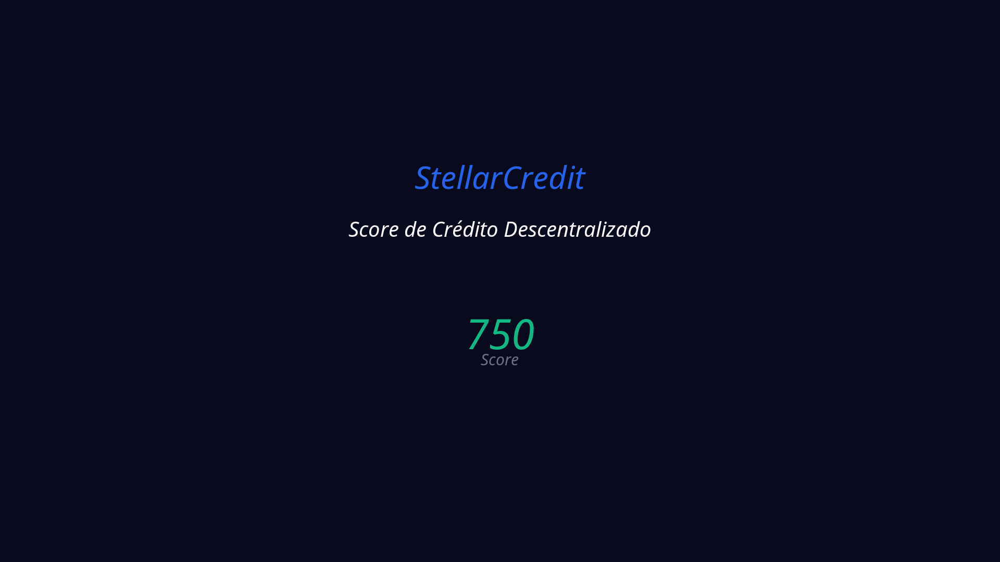

# 🌟 Stellar Credit - Plataforma de Score de Crédito Descentralizada

### 🏆 Desenvolvido pela equipe **Atlantic Hacking** para **HackMeridian 2025**


*[English](#english) | [Português](#português)*

---

## 🇧🇷 Português

### 📋 Visão Geral

O **Stellar Credit** é uma solução inovadora que revoluciona o sistema de crédito tradicional usando tecnologia blockchain. Nossa plataforma analisa transações on-chain da rede Stellar para calcular scores de crédito em tempo real e oferecer empréstimos automatizados.

#### 🎯 Problema Resolvido
- **Exclusão Financeira**: 2+ bilhões de pessoas sem acesso a serviços financeiros
- **Processo Lento**: Aprovação de crédito tradicional leva 7+ dias
- **Custo Alto**: Taxas bancárias elevadas para análise de crédito
- **Falta de Transparência**: Algoritmos opacos de scoring

#### 💡 Nossa Solução
- ⚡ **Análise Instantânea**: Score calculado em 30 segundos
- 💰 **90% Mais Barato**: Redução drástica de custos operacionais
- 🌍 **Inclusão Global**: Qualquer carteira Stellar pode participar
- 🔍 **Transparência Total**: Algoritmo auditável e open-source
- 🌍 **Suporte Bilíngue**: Interface em português e inglês

## 🚀 Deploy Automático Ativo

### 🌐 URLs de Produção
- **🖥️ Frontend**: https://stellar-credit-frontend.vercel.app
- **⚙️ Backend API**: https://stellar-credit-backend.vercel.app
- **📊 Health Check**: https://stellar-credit-backend.vercel.app/health
- **🔗 Contrato Testnet**: https://stellar.expert/explorer/testnet/contract/CAYPRCSUC4XEQSYPJMU2VBUMY2CI6CG4JIRDO7UJBGVN77JRJQOB6EKR

### ⚡ CI/CD Automático
- **Deploy Frontend**: Automático via Vercel + GitHub (qualquer push em `frontend/`)
- **Deploy Backend**: Automático via Vercel + GitHub (qualquer push em `backend/`)
- **Build Time**: ~2-3 minutos
- **Status**: ✅ Totalmente funcional

## 🛠️ Stack Tecnológica

### Frontend (Next.js)
- **Framework**: Next.js 15.1.4 + **TypeScript**
- **Styling**: TailwindCSS + Headless UI
- **Blockchain**: Stellar SDK + Freighter Wallet
- **State**: Zustand para gerenciamento de estado
- **Auth**: WebAuthn (Passkeys) + Multi-wallet
- **Deploy**: Vercel com CI/CD automático
- **i18n**: Suporte português/inglês

### Backend (Node.js)
- **Framework**: Node.js + Express
- **Blockchain**: Stellar SDK para integração
- **Database**: SQLite para dados locais
- **AI Engine**: Python para algoritmos de IA
- **Deploy**: Vercel serverless functions
- **Security**: CORS, Rate limiting, JWT

### Blockchain
- **Smart Contracts**: Soroban (Rust)
- **Network**: Stellar Testnet (configurado)
- **Contract ID**: `CAYPRCSUC4XEQSYPJMU2VBUMY2CI6CG4JIRDO7UJBGVN77JRJQOB6EKR`
- **Explorer**: Stellar Expert integration

## 🏗️ Arquitetura

```
┌─────────────────┐    ┌─────────────────┐    ┌─────────────────┐
│   Frontend      │    │    Backend      │    │   Blockchain    │
│   Dashboard     │◄──►│   API REST      │◄──►│   Soroban       │
│   (Next.js)     │    │   (Node.js)     │    │   Contracts     │
└─────────────────┘    └─────────────────┘    └─────────────────┘
         │                       │                       │
         │              ┌─────────────────┐              │
         └─────────────►│   IA Scoring    │◄─────────────┘
                        │   (Python)      │
                        └─────────────────┘
```

## 🚀 Funcionalidades Principais

### 1. 🔐 Autenticação Simplificada
- Conexão via **Stellar Passkeys**
- Autenticação biométrica segura
- Sem necessidade de senhas complexas

### 2. 📊 Análise de Score Inteligente
- **5 Métricas Principais**:
  - Volume de transações (20%)
  - Pontualidade de pagamentos (30%)
  - Frequência de uso (15%)
  - Diversificação de transações (20%)
  - Saldo médio mantido (15%)

### 3. 💰 Ofertas de Empréstimo Personalizadas
- **Score 700+**: Até $1.000 (juros 2%/mês)
- **Score 500-699**: Até $500 (juros 4%/mês)
- **Score 300-499**: Até $200 (juros 6%/mês)

### 4. 📈 Dashboard Interativo
- Score em tempo real
- Histórico de evolução
- Simulador de empréstimos
- Análise de transações

## 🎯 Cronograma de Desenvolvimento (30h)

### Dia 1 (0-12h)
- **H1-2**: Setup do projeto e dados mock
- **H3-6**: Implementação do algoritmo de IA
- **H7-10**: Desenvolvimento do smart contract Soroban
- **H11-12**: Planejamento e revisão

### Dia 2 (12-24h)
- **H13-18**: Frontend base com Passkeys
- **H19-22**: Backend API REST
- **H23-24**: Integração inicial

### Dia 3 (24-30h)
- **H25-28**: Integração completa
- **H29-30**: Testes finais e demo prep

## 🌐 Acesso Direto (Recomendado)

### 🚀 Teste Imediatamente
Acesse diretamente nossa aplicação em produção:
- **🖥️ App Principal**: https://stellar-credit-frontend.vercel.app
- **📱 Responsivo**: Funciona em mobile, tablet e desktop
- **🔗 API**: https://stellar-credit-backend.vercel.app

### ⚡ Como Usar
1. **Acesse** https://stellar-credit-frontend.vercel.app
2. **Conecte** sua carteira Stellar (Freighter, Rabet, etc.)
3. **Analise** seu score automaticamente
4. **Explore** ofertas de empréstimo personalizadas

## 📦 Desenvolvimento Local (Opcional)

### Pré-requisitos
```bash
# Node.js e Python
node --version  # v18+
python --version  # v3.8+

# Para desenvolvimento de contratos
curl --proto '=https' --tlsv1.2 -sSf https://sh.rustup.rs | sh
cargo install --locked soroban-cli
```

### Setup Rápido
```bash
# Clone o repositório
git clone https://github.com/Jistriane/StellarCredit-1.0
cd StellarCredit-1.0

# Iniciar todos os serviços
./init_system.sh

# URLs locais:
# Frontend: http://localhost:3000
# Backend: http://localhost:3001
# AI Engine: http://localhost:8001
```

### Deploy Manual (Se Necessário)
```bash
# Frontend
cd frontend
npm run build
vercel --prod

# Backend
cd ../backend
vercel --prod

# Contrato (já deployado)
cd ../contracts
soroban contract deploy --network testnet
```

### 📜 Deploy do Contrato (Testnet)

- **Data/Hora**: 2025-09-16 04:49:37
- **Rede**: testnet
- **Conta (Public Key)**: `GCKZ35K7GMUJBFKBOS2YM7FUHATM5FHHFGH7AVNGC5TXLFGV265G33QX`
- **Contract ID**: `CAYPRCSUC4XEQSYPJMU2VBUMY2CI6CG4JIRDO7UJBGVN77JRJQOB6EKR`
- **Explorer (Contrato)**: https://stellar.expert/explorer/testnet/contract/CAYPRCSUC4XEQSYPJMU2VBUMY2CI6CG4JIRDO7UJBGVN77JRJQOB6EKR
- **Explorer (Tx de Deploy)**: https://stellar.expert/explorer/testnet/tx/138c358f0f1338b798b014d4d74f5a0ddb5cd481e5523416d33f3fe47dfdd473
- **Variável de ambiente**: `STELLAR_CREDIT_CONTRACT_ID=CAYPRCSUC4XEQSYPJMU2VBUMY2CI6CG4JIRDO7UJBGVN77JRJQOB6EKR`
- **Log do deploy**: `logs/contract_deploy_20250916_044921.log`

Observações:
- O ID do contrato também foi salvo automaticamente em `.env.contract` na raiz do projeto.
- O backend carrega automaticamente o `.env.contract` e mapeia `STELLAR_CREDIT_CONTRACT_ID` para `CONTRACT_ADDRESS` se necessário.
- Caso faça um novo deploy, atualize esta seção com o novo `Contract ID` e links do explorer correspondentes.

## 🧪 Demonstração

### Personas de Teste
1. **João** (Score 750) - Bom pagador
2. **Maria** (Score 450) - Pagador médio
3. **Carlos** (Score 300) - Novo usuário

### Fluxo da Demo
1. **Conectar Carteira** → Stellar Passkeys
2. **Análise Automática** → Busca transações
3. **Cálculo de Score** → IA processa dados
4. **Ofertas Personalizadas** → Empréstimos disponíveis
5. **Solicitação** → Aprovação instantânea

## 📊 Impacto Esperado

- **Velocidade**: 30 segundos vs 7 dias (tradicional)
- **Custo**: 90% redução em taxas
- **Inclusão**: Acesso global via Stellar
- **Transparência**: Algoritmo auditável

## 🔗 Links Úteis

- [Documentação Stellar](https://developers.stellar.org/)
- [Soroban Docs](https://stellar.org/soroban)
- [Stellar Passkeys](https://stellar.org/blog/foundation-news/introducing-the-new-stellar-passkey-feature-seamless-web3-smart-wallet-functionality-on-mainnet)
- [Testnet Stellar](https://laboratory.stellar.org/)

## 🤝 Contribuindo

1. Fork o projeto
2. Crie uma branch (`git checkout -b feature/nova-funcionalidade`)
3. Commit suas mudanças (`git commit -am 'Adiciona nova funcionalidade'`)
4. Push para a branch (`git push origin feature/nova-funcionalidade`)
5. Abra um Pull Request

## 📄 Licença

Este projeto está licenciado sob a MIT License - veja o arquivo [LICENSE](LICENSE) para detalhes.

---

**Desenvolvido com ❤️ pela equipe Atlantic Hacking para o Hackathon Meridian 2025**

---

## 🇺🇸 English



### 📋 Overview

**Stellar Credit** is an innovative solution that revolutionizes the traditional credit system using blockchain technology. Our platform analyzes on-chain transactions from the Stellar network to calculate credit scores in real-time and offer automated loans.

#### 🎯 Problem Solved
- **Financial Exclusion**: 2+ billion people without access to financial services
- **Slow Process**: Traditional credit approval takes 7+ days
- **High Cost**: Expensive banking fees for credit analysis
- **Lack of Transparency**: Opaque scoring algorithms

#### 💡 Our Solution
- ⚡ **Instant Analysis**: Score calculated in 30 seconds
- 💰 **90% Cheaper**: Drastic reduction in operational costs
- 🌍 **Global Inclusion**: Any Stellar wallet can participate
- 🔍 **Total Transparency**: Auditable and open-source algorithm
- 🌍 **Bilingual Support**: Interface in Portuguese and English

## 🚀 Automatic Deploy Active

### 🌐 Production URLs
- **🖥️ Frontend**: https://stellar-credit-frontend.vercel.app
- **⚙️ Backend API**: https://stellar-credit-backend.vercel.app
- **📊 Health Check**: https://stellar-credit-backend.vercel.app/health
- **🔗 Testnet Contract**: https://stellar.expert/explorer/testnet/contract/CAYPRCSUC4XEQSYPJMU2VBUMY2CI6CG4JIRDO7UJBGVN77JRJQOB6EKR

### ⚡ Automatic CI/CD
- **Frontend Deploy**: Automatic via Vercel + GitHub (any push to `frontend/`)
- **Backend Deploy**: Automatic via Vercel + GitHub (any push to `backend/`)
- **Build Time**: ~2-3 minutes
- **Status**: ✅ Fully functional

### 🛠️ Technology Stack

#### Frontend (Next.js)
- **Framework**: Next.js 15.1.4 + **TypeScript**
- **Styling**: TailwindCSS + Headless UI
- **Blockchain**: Stellar SDK + Freighter Wallet
- **State**: Zustand for state management
- **Auth**: WebAuthn (Passkeys) + Multi-wallet
- **Deploy**: Vercel with automatic CI/CD
- **i18n**: Portuguese/English support

#### Backend (Node.js)
- **Framework**: Node.js + Express
- **Blockchain**: Stellar SDK for integration
- **Database**: SQLite for local data
- **AI Engine**: Python for AI algorithms
- **Deploy**: Vercel serverless functions
- **Security**: CORS, Rate limiting, JWT

#### Blockchain
- **Smart Contracts**: Soroban (Rust)
- **Network**: Stellar Testnet (configured)
- **Contract ID**: `CAYPRCSUC4XEQSYPJMU2VBUMY2CI6CG4JIRDO7UJBGVN77JRJQOB6EKR`
- **Explorer**: Stellar Expert integration

## 🌐 Direct Access (Recommended)

### 🚀 Try Immediately
Access our production application directly:
- **🖥️ Main App**: https://stellar-credit-frontend.vercel.app
- **📱 Responsive**: Works on mobile, tablet and desktop
- **🔗 API**: https://stellar-credit-backend.vercel.app

### ⚡ How to Use
1. **Access** https://stellar-credit-frontend.vercel.app
2. **Connect** your Stellar wallet (Freighter, Rabet, etc.)
3. **Analyze** your score automatically
4. **Explore** personalized loan offers

## 📦 Local Development (Optional)

### Prerequisites
```bash
# Node.js and Python
node --version  # v18+
python --version  # v3.8+

# For contract development
curl --proto '=https' --tlsv1.2 -sSf https://sh.rustup.rs | sh
cargo install --locked soroban-cli
```

### Quick Setup
```bash
# Clone repository
git clone https://github.com/Jistriane/StellarCredit-1.0
cd StellarCredit-1.0

# Start all services
./init_system.sh

# Local URLs:
# Frontend: http://localhost:3000
# Backend: http://localhost:3001
# AI Engine: http://localhost:8001
```

### Manual Deploy (If Needed)
```bash
# Frontend
cd frontend
npm run build
vercel --prod

# Backend
cd ../backend
vercel --prod

# Contract (already deployed)
cd ../contracts
soroban contract deploy --network testnet
```

### 📜 Contract Deployment (Testnet)

- **Date/Time**: 2025-09-16 04:49:37
- **Network**: testnet
- **Account (Public Key)**: `GCKZ35K7GMUJBFKBOS2YM7FUHATM5FHHFGH7AVNGC5TXLFGV265G33QX`
- **Contract ID**: `CAYPRCSUC4XEQSYPJMU2VBUMY2CI6CG4JIRDO7UJBGVN77JRJQOB6EKR`
- **Explorer (Contract)**: https://stellar.expert/explorer/testnet/contract/CAYPRCSUC4XEQSYPJMU2VBUMY2CI6CG4JIRDO7UJBGVN77JRJQOB6EKR
- **Explorer (Deploy Tx)**: https://stellar.expert/explorer/testnet/tx/138c358f0f1338b798b014d4d74f5a0ddb5cd481e5523416d33f3fe47dfdd473
- **Env variable**: `STELLAR_CREDIT_CONTRACT_ID=CAYPRCSUC4XEQSYPJMU2VBUMY2CI6CG4JIRDO7UJBGVN77JRJQOB6EKR`
- **Deploy log**: `logs/contract_deploy_20250916_044921.log`

Notes:
- The contract ID is also saved automatically in `.env.contract` at the project root.
- The backend automatically loads `.env.contract` and maps `STELLAR_CREDIT_CONTRACT_ID` to `CONTRACT_ADDRESS` if needed.
- If you perform a new deploy, update this section with the new `Contract ID` and corresponding explorer links.

#### Connect Wallet
1. Install [Freighter Wallet](https://freighter.app/)
2. Configure for Testnet
3. Access http://localhost:3000
4. Click "Connect Wallet"
5. Authorize with your biometrics (Passkeys)

### 🤖 Bilingual AI Agents

#### Portuguese Agent
```bash
npx @elizaos/cli start --character stellar-credit-ai-agent.json
```

#### English Agent
```bash
npx @elizaos/cli start --character stellar-credit-ai-agent-en.json
```

### 🌍 Language Support

The platform supports:
- **Portuguese (pt-BR)**: Native Brazilian Portuguese
- **English (en-US)**: International English
- **Auto-detection**: Browser language detection
- **Persistence**: Saves user preference

### 📊 Key Features

#### 🔐 Universal Wallet Support
- **10+ carteiras suportadas**: Freighter, Albedo, Rabet, xBull, LOBSTR, etc.
- **Stellar Passkeys**: Autenticação biométrica
- **Multi-plataforma**: Desktop, mobile, web
- **Carteiras XLM nativas**: Suporte completo

#### 📈 AI-Powered Scoring
- 5 weighted metrics
- Real-time analysis
- Transparent algorithm

#### 💰 Automated Loans
- Instant approval for high scores
- Competitive rates
- Smart contract execution

#### 🌐 Global Accessibility
- Works with any Stellar wallet
- No banking history required
- Inclusive financial system

### 📚 Documentation

#### Development Guides
- [Quick Start Guide](QUICK_START.md)
- [Wallet Support](WALLET_SUPPORT.md)
- [Bilingual Support](BILINGUAL_SUPPORT.md)
- [Responsive Design](RESPONSIVE_DESIGN.md)
- [Logo Guide](LOGO_GUIDE.md)
- [Integration Guide](stellar-credit-integration.md)

#### Technical Documentation
- [📋 Complete Technical Documentation (PT)](docs/TECHNICAL_DOCUMENTATION.pt.md)
- [📋 Complete Technical Documentation (EN)](docs/TECHNICAL_DOCUMENTATION.en.md)
- [Architecture](docs/ARCHITECTURE.md)
- [API Documentation](docs/API_DOCUMENTATION.md)
- [Deployment Guide](docs/DEPLOYMENT.md)

#### Deploy Guides
- [Frontend Vercel Deploy](docs/FRONTEND_VERCEL_DEPLOY.md)
- [Backend Vercel Deploy](docs/BACKEND_VERCEL_DEPLOY.md)
- [Vercel Configuration](docs/VERCEL_DEPLOY_CONFIG.md)

### 🏆 For Hackathon Meridian 2025 - Atlantic Hacking Team

#### Demo Script (5 minutes)
1. **Minute 1**: Present financial exclusion problem
2. **Minute 2**: Connect wallet with Passkeys
3. **Minute 3**: Real-time score calculation
4. **Minute 4**: Automatic loan offers
5. **Minute 5**: Conversational AI agent

#### Competitive Advantages
- 🚀 **90% cheaper** than traditional systems
- ⚡ **200x faster** (30s vs 7 days)
- 🌍 **Global inclusion** for 2+ billion people
- 🔍 **Total transparency** vs opaque banking algorithms
- 🤖 **First conversational AI** for DeFi Credit

### 🤝 Contributing

1. Fork the project
2. Create a feature branch
3. Commit your changes
4. Push to the branch
5. Open a Pull Request

### 📄 License

This project is licensed under the MIT License.

**Developed with ❤️ by Atlantic Hacking team for Hackathon Meridian 2025**
