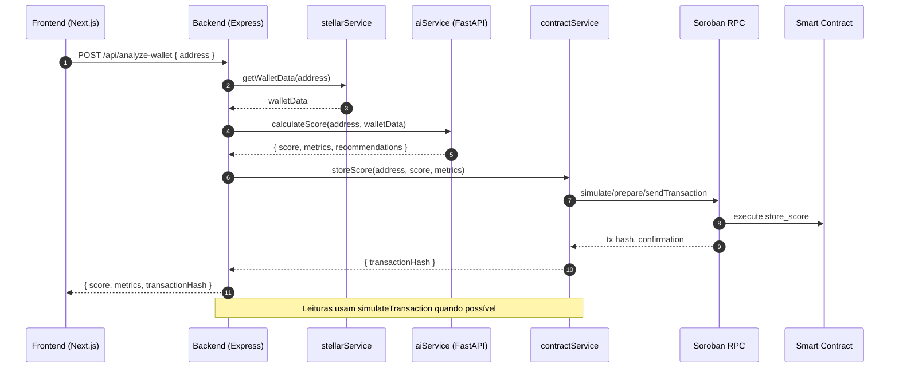
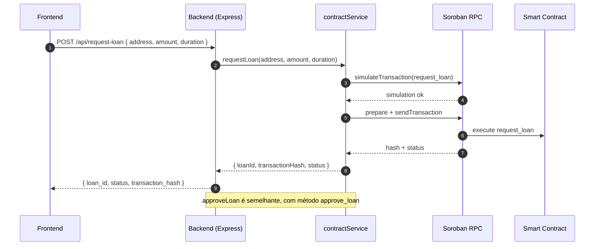
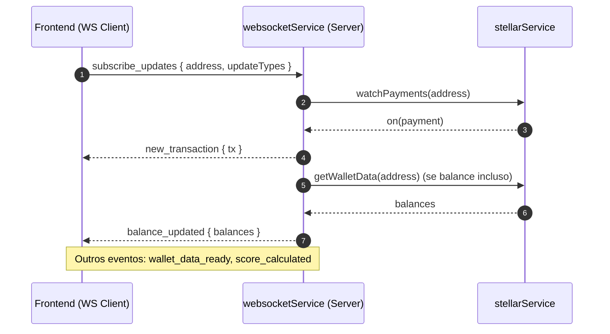

# Stellar Credit — Arquitetura do Projeto

Este documento descreve a arquitetura do Stellar Credit, uma plataforma descentralizada de score de crédito e empréstimos baseada na rede Stellar (Soroban).

## Visão Geral

Componentes principais:
- Frontend (Next.js 14 + TypeScript)
- Backend API (Node.js + Express)
- Engine de IA (Python)
- Blockchain (Soroban Smart Contracts em Rust)
- Integrações (Stellar Horizon/Soroban RPC, carteiras)

```
┌─────────────────┐    ┌──────────────────────────────┐    ┌─────────────────────────┐
│   Frontend      │    │           Backend            │    │        Blockchain       │
│   Next.js       │◄──►│ Express API + WebSockets     │◄──►│ Soroban Smart Contract  │
│                 │    │  • contractService           │    │  • Score/Loans Storage  │
└─────────────────┘    │  • stellarService            │    │                         │
         ▲              │  • aiService (bridge)        │    └─────────────────────────┘
         │              └──────────────────────────────┘                 ▲
         │                         ▲                                     │
         │                         │                                     │
         │              ┌───────────────────┐                            │
         └──────────────│   Engine de IA    │────────────────────────────┘
                        │  (Python FastAPI) │
                        └───────────────────┘
```

### Diagramas (Mermaid)

```mermaid
flowchart LR
  subgraph Client[Frontend - Next.js]
    UI[Pages/Components]
    Providers[Providers (Theme, Realtime, Wallet)]
  end

  subgraph API[Backend - Express]
    WS[WebSocket Service]
    ST[stellarService]
    CT[contractService]
    AI[aiService]
  end

  subgraph Chain[Soroban / Stellar]
    RPC[Soroban RPC]
    SC[Smart Contract]
    HZ[Horizon]
  end

  subgraph ML[Engine de IA - Python]
    FASTAPI[FastAPI]
  end

  UI <--> |HTTP/WS| API
  Providers <--> |WS| WS
  ST <--> |HTTP| HZ
  CT <--> |RPC| RPC
  RPC <--> SC
  AI <--> |HTTP| FASTAPI
```



## Repositório e Estrutura

- `frontend/` — aplicação Next.js (páginas, componentes e hooks)
- `backend/` — API REST, serviços de integração com Stellar e contrato
- `ai-engine/` — serviços Python para cálculo de score (FastAPI)
- `contracts/` — contrato Soroban em Rust
- `scripts/` — automações (deploy do contrato, inicialização)
- `logs/` — logs de deploy e inicialização
- `docs/` — documentação (este arquivo, deployments, etc.)

## Componentes

### Frontend (Next.js)
- Páginas em `frontend/src/app/[locale]/*`
- Autenticação e carteiras em `frontend/src/components/wallet` e `passkey/`
- Provedores (tema, realtime, notificações) em `frontend/src/components/providers`
- Comunicação com backend via REST/WebSocket
- Internacionalização com mensagens em `frontend/src/messages/*.json`

### Backend (Node.js + Express)
- Entrypoint: `backend/server.js`
- Serviços:
  - `services/contractService.js`: integra Soroban (`@stellar/stellar-sdk`), lê `CONTRACT_ADDRESS`
  - `services/stellarService.js`: dados de contas/txs via Horizon
  - `services/aiService.js`: chama o motor de IA
  - `services/websocketService.js`: eventos realtime com o frontend
- Middlewares: `middleware/auth.js`, `middleware/validation.js`
- Segurança: `helmet`, rate limiting, CORS restrito, compressão, logging
- Configuração de ambiente:
  - `.env` padrão
  - `.env.contract` (raiz) gerado pelo deploy com `STELLAR_CREDIT_CONTRACT_ID`
  - Mapeamento automático para `CONTRACT_ADDRESS` (implementado em `server.js`)

### Engine de IA (Python)
- FastAPI (ver `ai-engine/api_server.py`)
- Calcula score a partir de dados on-chain vindos do backend
- Requisitos em `ai-engine/requirements.txt`

### Blockchain (Soroban)
- Código do contrato em `contracts/src/lib.rs`
- Compilação para `wasm32-unknown-unknown`
- Deploy automatizado via `scripts/deploy_contract.sh`
- Dados persistidos no contrato: score, métricas e empréstimos

## Fluxos Principais

### 1) Cálculo de Score
1. Frontend solicita `POST /api/analyze-wallet` com `address`
2. Backend valida endereço e busca dados da carteira (`stellarService`)
3. Backend envia dados para IA (`aiService`) e obtém `score` + `metrics`
4. Backend armazena o score no contrato (`contractService.storeScore`)
5. Backend retorna score, métricas, recomendações e hash da transação

### 2) Consulta de Score
1. Frontend chama `GET /api/score/:address`
2. Backend consulta o contrato (`get_score`) via simulação RPC
3. Retorna score, métricas e `last_updated`

### 3) Ofertas de Empréstimo
1. Frontend chama `GET /api/loan-offers/:score`
2. Backend usa `contractService.getLoanOffers(score)`
3. Se contrato indisponível, retorna ofertas mockadas

### 4) Solicitação de Empréstimo
1. Frontend envia `POST /api/request-loan`
2. Backend valida e chama `contractService.requestLoan`
3. Retorna `loan_id`, `status` e `transaction_hash`

### 5) Realtime/Notificações
- WebSocket (`websocketService`) envia eventos:
  - `wallet_data_ready`, `score_calculated`, `new_transaction`, `balance_updated`
- Assinaturas configuradas no frontend

### Diagramas adicionais (Mermaid)

#### Fluxo de Empréstimo (request_loan e approve_loan)



#### Realtime WebSocket (eventos da carteira)



#### Componentes do Frontend

```mermaid
flowchart TB
  subgraph App[Next.js App]
    L[app/[locale]/layout.tsx]
    P[Providers]
    R[Routes/Páginas]
  end

  subgraph Providers
    TP[ThemeProvider]
    RT[RealtimeProvider]
    NP[NotificationProvider]
    WP[WalletProvider]
    WDP[WalletDataProvider]
  end

  subgraph Components
    WC[WalletConnector]
    WB[WalletButton]
    DG[Dashboard]
    SI[ScoreIndicator]
    EC[ElisaChat]
  end

  L-->P
  P-->TP
  P-->RT
  P-->NP
  P-->WP
  P-->WDP
  P-->R
  R-->DG
  R-->EC
  DG-->SI
  R-->WC
  WC-->WB
```

## Configuração e Ambientes

Variáveis relevantes:
- `STELLAR_NETWORK` — `testnet` (default) ou `public`
- `CONTRACT_ADDRESS` — endereço do contrato Soroban
- `STELLAR_CREDIT_CONTRACT_ID` — definido no `.env.contract`; mapeado para `CONTRACT_ADDRESS`
- `ADMIN_SECRET_KEY` — chave secreta da conta admin (operações no contrato)
- `PORT`, `FRONTEND_URL`, etc.

Carregamento do contrato:
- `scripts/deploy_contract.sh` escreve `.env.contract` com `STELLAR_CREDIT_CONTRACT_ID`
- `backend/server.js` carrega `.env.contract` e preenche `CONTRACT_ADDRESS` automaticamente

## Deploy e Operação

- Deploy do contrato: `scripts/deploy_contract.sh`
  - Compila, configura rede/identidade, faz deploy e inicializa
  - Salva o Contract ID em `.env.contract` e gera logs em `logs/`
- Serviços de aplicação:
  - Frontend: `npm run dev` em `frontend/`
  - Backend: `npm run dev` em `backend/`
  - IA: `python ai-engine/api_server.py` (ou via script dedicado)

## Segurança

- Backend usa `helmet`, `express-rate-limit`, CORS e validações
- Chaves privadas somente no servidor (`ADMIN_SECRET_KEY`), nunca no frontend
- Passkeys/Carteiras no frontend com autenticação do usuário
- Logs sem vazar segredos

## Observabilidade

- Logs estruturados em `logs/`
- Endpoints de health check (`/health`) e estatísticas (`/api/stats`, `/api/ws/stats`)

## Decisões Arquiteturais

- Separação de responsabilidades (Frontend/Backend/IA/Contrato)
- Fallbacks e mocks quando o contrato não está disponível
- Carregamento automático do ID do contrato para reduzir erros de configuração
- Uso de simulação Soroban para leituras rápidas e baratas

## Próximos Passos

- Adicionar testes automatizados (unitários e integração)
- Observabilidade ampliada (tracing, métricas)
- Pipeline CI/CD com step de atualização automática de `docs/DEPLOYMENTS.md`
- Hardenings adicionais (WAF, secrets manager)
