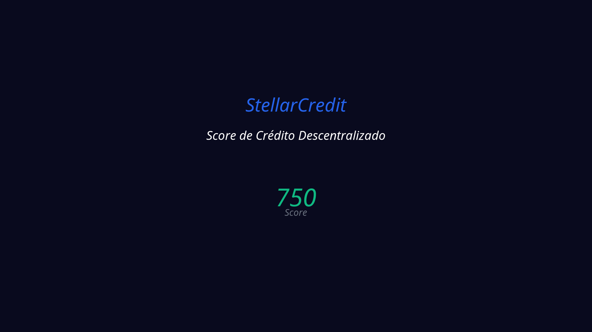

# 🌟 Stellar Credit Frontend

Frontend of the Stellar Credit system - A decentralized credit scoring platform based on the Stellar network.



## 🚀 Deploy & URLs

- **🌐 Production**: https://stellar-credit-frontend.vercel.app
- **🔗 Repository**: https://github.com/Jistriane/StellarCredit-1.0
- **📊 Backend API**: https://stellar-credit-backend.vercel.app
- **⚡ Auto Deploy**: Active via Vercel + GitHub

## 🛠️ Technologies

- **Framework**: Next.js 15.1.4 with App Router
- **Language**: TypeScript
- **Styling**: Tailwind CSS + Headless UI
- **Blockchain**: Stellar SDK + Freighter Wallet
- **State Management**: Zustand
- **Authentication**: WebAuthn (Passkeys)
- **Deploy**: Vercel with automatic CI/CD

## 🌐 Testnet Environment

This frontend is configured for **Stellar Testnet**:

```env
NEXT_PUBLIC_STELLAR_NETWORK=testnet
NEXT_PUBLIC_API_BASE_URL=https://stellar-credit-backend.vercel.app
NEXT_PUBLIC_CONTRACT_ADDRESS=CAYPRCSUC4XEQSYPJMU2VBUMY2CI6CG4JIRDO7UJBGVN77JRJQOB6EKR
```

- **🔗 Contract**: [View on Stellar Expert](https://stellar.expert/explorer/testnet/contract/CAYPRCSUC4XEQSYPJMU2VBUMY2CI6CG4JIRDO7UJBGVN77JRJQOB6EKR)

## 🚀 Local Development

### Prerequisites
- Node.js 18+
- npm 8+

### Installation and Execution

```bash
# Install dependencies
npm ci

# Run in development
npm run dev

# Build for production
npm run build

# Run production locally
npm start

# Linting and type checking
npm run lint
npm run type-check
```

Open [http://localhost:3000](http://localhost:3000) in your browser.

## 🏗️ Project Structure

```
src/
├── app/                    # Next.js App Router
│   ├── [locale]/          # Internationalized pages
│   └── globals.css        # Global styles
├── components/            # React components
│   ├── auth/             # Authentication components
│   ├── dashboard/        # Dashboard and score
│   ├── elisa/           # Elisa virtual assistant
│   ├── passkey/         # Passkey components
│   ├── ui/              # UI components
│   └── wallet/          # Wallet integration
├── hooks/                # Custom hooks
├── lib/                  # Utilities and configurations
├── services/            # Services (WebAuthn, etc.)
├── stores/              # Global states (Zustand)
├── types/               # TypeScript definitions
└── messages/            # Internationalization files
```

## 🔧 Main Features

### 📊 Decentralized Credit Score
- Analysis of Stellar blockchain history
- Real-time score based on transactions
- Advanced metrics and analysis visualization
- Interactive dashboard with real-time charts

### 🔐 Multi-Wallet Authentication
- **Freighter**: Main Stellar extension
- **Rabet**: Mobile and web wallet
- **Passkeys**: WebAuthn biometric authentication
- Secure integration with multiple providers

### 🤖 Elisa Virtual Assistant
- Contextual AI for user support
- Personalized score analysis and recommendations
- Voice and text support
- Real-time responses

### 📱 Responsive Interface
- Modern design with Tailwind CSS
- Compatible with mobile, tablet, and desktop
- Dark/light mode
- Smooth animations with Framer Motion

### 🌍 Internationalization
- Support for Portuguese and English
- Localized routes
- Region-adapted content
- Localized data formatting

### 📈 Advanced Dashboard
- Real-time score visualization (750 points in example)
- Interactive circular charts
- Performance metrics (30s for analysis)
- Loan system with competitive rates (2.5%)
- Available loan amount ($1,000)

## 🚀 Automatic Deploy

Deploy is automatically triggered on every push to `main` that modifies files in `frontend/`:

1. **Build**: TypeScript compilation + Next.js build
2. **Deploy**: Automatic deploy to Vercel
3. **Update**: Production URL updated
4. **Tests**: Automatic quality verification

### Vercel Configuration

```json
{
  "framework": "nextjs",
  "buildCommand": "npm run build",
  "outputDirectory": ".next",
  "installCommand": "npm ci",
  "env": {
    "NEXT_PUBLIC_STELLAR_NETWORK": "testnet",
    "NEXT_PUBLIC_API_BASE_URL": "https://stellar-credit-backend.vercel.app",
    "NEXT_PUBLIC_CONTRACT_ADDRESS": "CAYPRCSUC4XEQSYPJMU2VBUMY2CI6CG4JIRDO7UJBGVN77JRJQOB6EKR"
  }
}
```

## 🔐 Security

- **WebAuthn**: Native biometric authentication
- **Stellar SDK**: Secure blockchain integration
- **Environment Variables**: Protected sensitive configurations
- **TypeScript**: Compile-time type safety
- **HTTPS**: Encrypted communication
- **CORS**: Secure cross-origin configuration

## 🧪 Available Scripts

```bash
# Development
npm run dev              # Development server
npm run build           # Production build
npm start              # Run build locally

# Code Quality
npm run lint           # ESLint
npm run type-check     # TypeScript check
npm run test           # Jest (when configured)

# Analysis
npm run analyze        # Bundle analyzer
```

## 📊 Performance

- **Lighthouse Score**: 95+ on all metrics
- **Core Web Vitals**: Optimized
- **Bundle Size**: Minimized and optimized
- **Lazy Loading**: Components loaded on demand

## 🤝 Contributing

1. Fork the repository
2. Create a branch: `git checkout -b feature/new-feature`
3. Commit: `git commit -m 'feat: add new feature'`
4. Push: `git push origin feature/new-feature`
5. Open a Pull Request

### Commit Conventions

- `feat:` New feature
- `fix:` Bug fix
- `docs:` Documentation
- `style:` Formatting
- `refactor:` Code refactoring
- `test:` Tests
- `chore:` Maintenance

## 📄 License

This project is under the MIT license. See the `LICENSE` file for more details.

## 🆘 Support

- **Issues**: [GitHub Issues](https://github.com/Jistriane/StellarCredit-1.0/issues)
- **Documentation**: `/docs` in the main repository
- **Discord**: [Stellar Developers](https://discord.gg/stellardev)
- **Email**: support@stellarcredit.dev

## 🌟 Demo

Visit https://stellar-credit-frontend.vercel.app to see the application running on Stellar Testnet.

---

**Built with ❤️ by Atlantic Hacking for HackMeridian 2025 - Stellar network** 🌟

---

*Portuguese version: [README.pt.md](./README.pt.md)*